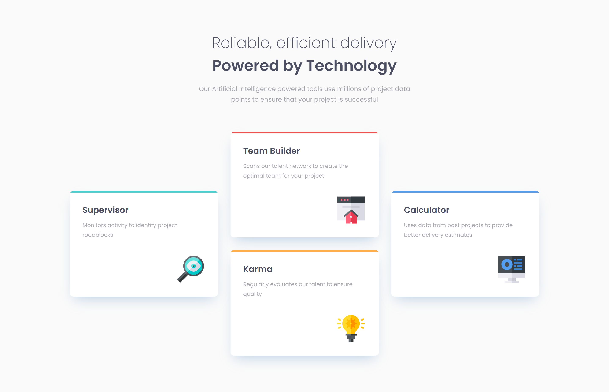
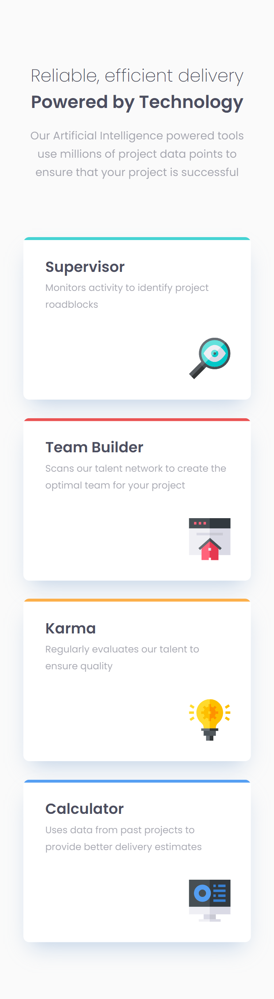

# Frontend Mentor - Four card feature section

This is a solution to the [Four card feature section challenge on Frontend Mentor](https://www.frontendmentor.io/challenges/four-card-feature-section-weK1eFYK). Frontend Mentor challenges help you improve your coding skills by building realistic projects. 

## Author

- Frontend Mentor - [@hcxweb](https://www.frontendmentor.io/profile/hcxweb)

### Screenshot

### Links

- Solution URL: [https://www.frontendmentor.io/solutions/four-card-feature-using-grid-and-flexbox-fa3mcXcwg]
- Live Site URL: [https://hcxweb.github.io/four-card-feature/]

### Built with

- Semantic HTML5 markup
- Flexbox
- CSS Grid